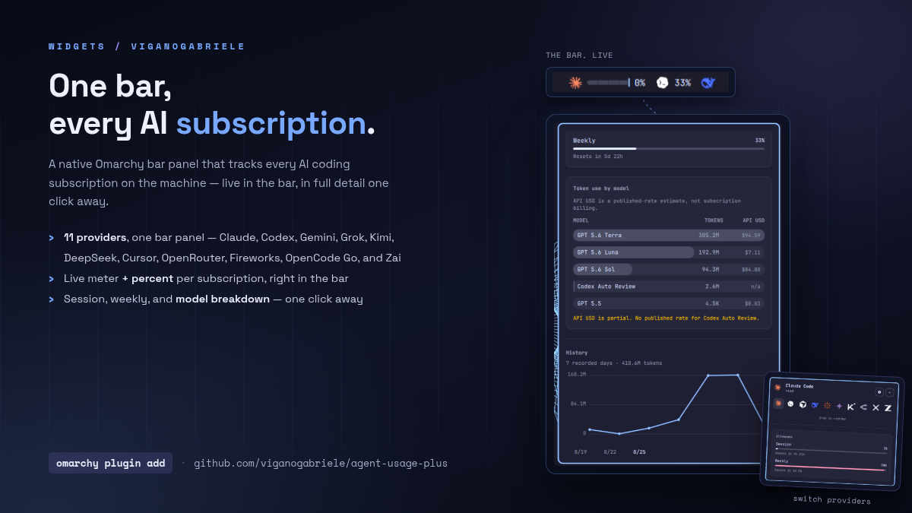

# Agent Usage Plus



<p align="center">
  
  
</p>

Native Omarchy bar widget for AI coding usage, limits, balances, pace, costs
and history. It reads Omarchy and local collector records, so it works with
subscriptions and API accounts without storing credentials.

Forked from the MIT-licensed `omarchy.agents` widget bundled with Omarchy and
expanded into a standalone plugin.

## Install

```bash
omarchy plugin add https://github.com/viganogabriele/agent-usage-plus.git --enable
```

## Update

```bash
omarchy plugin update io.github.viganogabriele.agent-usage-plus
```

## Remove

```bash
omarchy plugin remove io.github.viganogabriele.agent-usage-plus
```

## Providers

Claude Code, Codex, Fireworks, OpenRouter, DeepSeek, Gemini, Cursor, Kimi,
OpenCode Go, xAI/Grok and Z.AI/GLM.

Claude Code and Codex use Omarchy's built-in records. Other providers use the
optional collectors:

```bash
./collectors/install.sh
~/.local/share/agent-usage-plus-collectors/bin/agent-usage-plus-collectors update
```

Requires Omarchy with Quickshell plugin support. The plugin has no other
runtime dependency; optional collector setup is documented in
[collectors/README.md](collectors/README.md).

The widget follows Omarchy's live theme. Warn is fixed amber (`#F2B705`), and
notifications are off by default; when enabled, each provider alerts once at
Warn and once at Critical.

Details: [collector setup](collectors/README.md),
[record contract](docs/collector-contract.md), [manual QA](docs/manual-qa.md),
[troubleshooting](docs/troubleshooting.md), [contributing](CONTRIBUTING.md).

MIT licensed; see [LICENSE](LICENSE).
